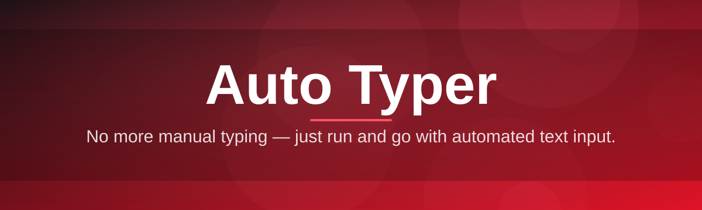
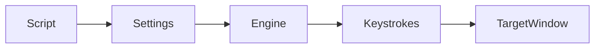

# auto-typer-tool ⌨️🚀

  

*Type once, replay forever — the Auto Typer that turns repetitive keystrokes into a single click.*

  

---

## 📖 Overview

**TL;DR:** auto-typer-tool is a lightweight Windows utility that simulates keyboard input on your behalf, so you stop retyping the same text a hundred times a day.

If you've ever copy-pasted the same paragraph into a chat box, filled out the same form fields across dozens of records, or needed to demo software typing "live" without actually typing, you already know the itch this project scratches. Auto Typer as a category has existed for decades in various clunky, ad-riddled, or abandoned forms — this tool is our answer to "why is this still so painful in 2026?" auto-typer-tool takes the core idea of automated text input and rebuilds it with a modern interface, predictable timing engine, and zero telemetry nonsense.

It's built for a wide range of people: developers testing input-heavy forms, QA engineers who need reproducible keystroke sequences, streamers and educators who want smooth on-screen typing during demos, data-entry workers stuck with repetitive fields, and hobbyists automating games or scripts that expect human-like typing cadence. Whether you need a single line typed once or a multi-thousand character script looped indefinitely, this project treats both as first-class use cases.

> [!NOTE]
> auto-typer-tool is intentionally scoped to *keyboard simulation*. It doesn't touch your mouse, doesn't read your screen, and doesn't phone home. It types — that's the whole job, done well.

---

## ⚡ Quick Start (before you read anything else)

**TL;DR:** visit the page, download, unzip, run — you're typing in under two minutes.

1. Open the landing page via the download button above.

2. Grab the latest standalone build for Windows 10/11.

3. Extract the folder and double-click `auto-typer-tool.exe` — no installer, no admin prompt required.

> [!TIP]
> Pin the executable to your taskbar after the first run. Ninety percent of users open this tool multiple times a day once they realize how much manual typing it removes from their routine.

---

## 🧩 What Actually Sucked Before This

**TL;DR:** old-school auto typers were either bloated adware, Windows-XP-era relics, or scripting nightmares that needed a programming language just to type "hello world" on a loop.

Most legacy Auto Typer software falls into one of three buckets: bloated freeware stuffed with bundled toolbars, ancient tools that barely render on modern displays and crash on multi-monitor setups, or raw scripting frameworks (AutoHotkey-style) that are powerful but demand you learn a syntax before you type a single character automatically. None of these are wrong tools to exist — but none of them are *pleasant* for someone who just wants to paste a block of text and have it typed out convincingly, with human-like pacing, on demand.

auto-typer-tool fixes this by giving you a clean GUI, sane defaults, adjustable typing speed with humanized jitter, hotkey-triggered start/stop, and a settings panel that doesn't require a manual to understand. You write or paste your text, tune the speed, hit the hotkey, and it types — into whatever window has focus, exactly like you would, just faster and without the wrist strain.

---

## 🔥 Capabilities That Make This Worth Keeping

**TL;DR:** speed control, hotkeys, loop mode, multi-profile scripts, and a UI that doesn't get in your way.

- **Adjustable typing cadence** — dial in characters-per-minute from deliberate-and-careful to blink-and-you-missed-it, with optional randomized jitter so output doesn't look robotic.

- **Global hotkey triggers** — start, pause, and stop typing from anywhere on your desktop without alt-tabbing back into the app.

- **Loop & repeat mode** — set a sequence to type once, N times, or indefinitely until manually stopped — great for stress-testing input fields or long-running demos.

- **Multi-profile script storage** — save several typing scripts side by side and switch between them instantly, instead of overwriting one text box every time.

- **Target-window awareness** — the tool respects whichever application currently has focus, so you point, click, and let it type into that field.

- **Countdown-before-start delay** — a configurable timer gives you a window to click into the destination field before the first keystroke fires.

- **Line-by-line and burst modes** — type content one line at a time with pauses, or fire an entire block in one continuous burst.

- **Portable, standalone build** — a single executable, no background services, no scheduled tasks quietly installed on your machine.

---

## 🖥️ System Requirements

**TL;DR:** if it runs Windows 10 or 11, it runs this.

| Requirement | Detail |
|---|---|
| OS | Windows 10 (64-bit) or Windows 11 |
| Dependencies | None — fully standalone executable |
| Disk space | Under 50 MB |
| RAM | Negligible, runs comfortably in the background |
| Admin rights | Not required for normal use |

> [!IMPORTANT]
> Some fullscreen games and secured input fields (password boxes, certain banking software) intentionally block simulated keystrokes at the OS level. This is expected behavior from Windows, not a bug in auto-typer-tool.

---

## 🛠️ How It Works

**TL;DR:** you write text, the engine schedules keystrokes, Windows delivers them to the focused window.

The internal flow is intentionally simple so behavior stays predictable:

1. You compose or paste your script into the editor panel.

2. You configure speed, jitter, delay, and repeat settings.

3. You arm the hotkey and click into your target application.

4. The typing engine converts your script into timed virtual keystrokes.

5. Windows delivers those keystrokes to whichever window currently has focus.

---

## 🩺 Troubleshooting

**TL;DR:** most issues trace back to focus, permissions, or antivirus overreacting to keyboard simulation software.

<strong>The tool types into the wrong window</strong>

Make sure the destination field is actually focused (cursor blinking in it) before your countdown delay ends. Increase the pre-start delay if you need more time to click into place.

<strong>My antivirus flagged the executable</strong>

Keyboard simulation tools trigger heuristic flags because the same technique used for automation is also used maliciously elsewhere. auto-typer-tool is open-source — review the code yourself or add a exclusion if you trust the source.

<strong>Typing doesn't work in a specific application</strong>

Some apps use elevated permissions or custom input handling that blocks simulated input from non-elevated processes. Try running as administrator, matching the target app's privilege level.

<strong>Special characters or emoji aren't typing correctly</strong>

Enable Unicode mode in Settings → Input. Some legacy applications only accept standard ASCII keystrokes and will silently drop unsupported characters.

<strong>The hotkey doesn't respond</strong>

Another application may already be bound to that key combination. Change the hotkey under Settings → Shortcuts to something unused.

> [!WARNING]
> Loop mode with no repeat limit will keep typing until you manually stop it. Always double-check your target window before enabling indefinite loops.

---

## 🎨 UI / UX Details

**TL;DR:** dark mode by default, everything is rebindable, and the settings panel fits on one screen.

- **Themes** — Dark (default), Light, and a high-contrast mode for accessibility.

- **Keyboard shortcuts:**

  - `Ctrl+Alt+S` — Start typing

  - `Ctrl+Alt+P` — Pause / resume

  - `Ctrl+Alt+X` — Stop typing immediately

  - `Ctrl+S` — Save current script profile

- **Settings panel** — speed slider, jitter percentage, start delay, repeat count, Unicode toggle — all in a single scrollable page, no nested menus to hunt through.

- **Profile switcher** — dropdown in the top bar lets you jump between saved scripts without losing your place.

> [!TIP]
> Enable "Compact Mode" in the View menu if you want the window to shrink to a small floating control bar while you work in other apps.

---

## 🤝 Contributing & Community

**TL;DR:** good first issues are labeled, PRs are welcomed warmly, and no contribution is too small.

We built auto-typer-tool as a community project, and it stays healthy because people like you show up with fixes, ideas, and fresh eyes. Whether you're fixing a typo in this README, squashing a focus-detection bug, or proposing a brand-new typing mode, there's a place for your contribution here.

- Check the **good first issue** label if this is your first time contributing to an open-source project — those are scoped intentionally small and well-documented.

- Open a discussion before large feature PRs so we can align on design before you invest hours in code.

- Bug reports with reproduction steps are gold — even a short GIF of the issue helps enormously.

> [!NOTE]
> No contribution is "too small." Fixing a broken link or clarifying a confusing setting label is just as valuable as a new feature.

---

## 📜 License

**TL;DR:** MIT, 2026, do what you want, just keep the license notice.

This project is released under the [MIT License](LICENSE). Fork it, remix it, ship it inside your own tooling — just retain the original license text.

---

## ⚠️ Disclaimer

**TL;DR:** use responsibly — this types text, it doesn't decide where that's appropriate.

auto-typer-tool simulates keyboard input for legitimate productivity, testing, and accessibility purposes. Respect the terms of service of any third-party application or platform you use this with. The maintainers are not responsible for misuse that violates another service's rules or applicable laws.

